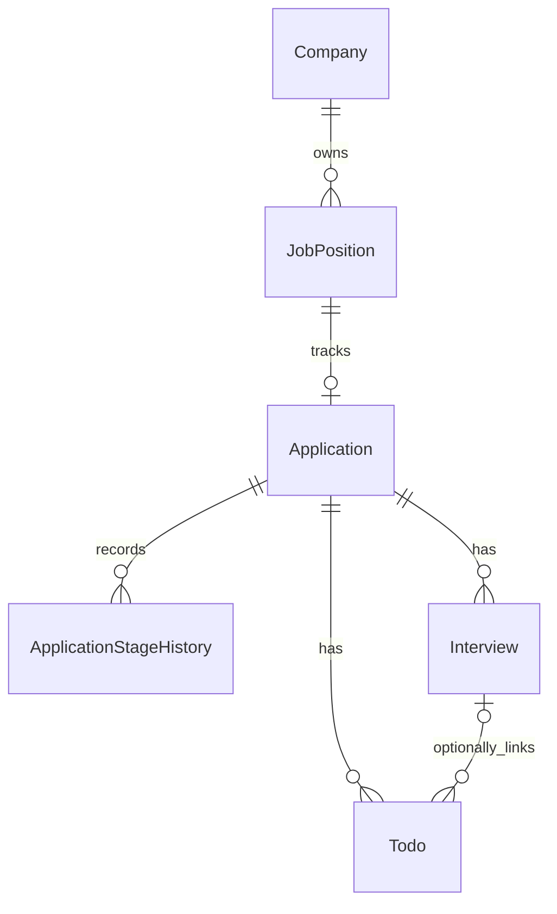

# 数据库与持久化模型

当前提供六表 V1、追加 V2，以及公司 / 岗位 / 投递 / 面试 / 待办 CRUD 和 Dashboard。模型使用单用户关系；没有 user_id、逻辑删除或 AI 扩展表。

## ER 关系



同一具体岗位最多一份投递档案；官网和内推等重复渠道记录主要渠道，其余入口可写备注。不同年份 / 招聘批次使用独立 JobPosition，保留各自 JD；公司名、岗位名不设置唯一键。

Todo 必须属于 Application，interview_id 可空；一旦关联面试，组合外键保证它们属于同一投递档案。所有外键使用 RESTRICT，防止删除父记录时抹去完整历史；关联不意味着已实现自动待办同步。

## 字段字典

所有表共用 id BIGINT 自增主键、created_at / updated_at DATETIME(6) 审计时间。数据库生成审计时间，Mapper 忽略调用方传入的审计字段；插入回写 id 后，若需要默认值和审计信息，应回查实体。审计时间不替代业务日期。

| 表 | 字段 | 类型与用途 |
|---|---|---|
| company | name、type、website、notes | VARCHAR(255) 名称必填；VARCHAR(32) 类型默认 OTHER；VARCHAR(2048) 官网与 TEXT 备注可空 |
| job_position | company_id、name、location、direction、jd、recruitment_batch | 公司外键与 VARCHAR(255) 名称必填；地点 VARCHAR(255)、方向 VARCHAR(128)、JD MEDIUMTEXT、批次 VARCHAR(64) 可空 |
| application | job_position_id、channel、applied_on | 岗位外键唯一；主要渠道 VARCHAR(64)、实际投递日期 DATE 可空 |
| application | submitted、current_stage、current_stage_on | 实际投递事实 BOOLEAN 默认 false；阶段 VARCHAR(24) 默认 TO_APPLY；阶段业务日期 DATE 可空 |
| application | end_reason、notes、version | 原因 VARCHAR(32) 仅 ENDED 必填；TEXT 备注可空；非负 INT version 默认 0，用于乐观锁 |
| application_stage_history | application_id、stage、stage_on、end_reason、remark | 投递外键与阶段必填；DATE 业务日期可空；ENDED 要求有效原因；TEXT 说明可空 |
| interview | application_id、round_name、interview_at、format | 投递外键与 VARCHAR(64) 轮次必填；DATETIME(6) 时刻和 VARCHAR(16) 形式可空 |
| interview | questions、answers、review、result | 问题、回答、复盘为 MEDIUMTEXT，结果为 TEXT；均可空，结果不自动改变阶段 |
| interview / todo | version | V2 追加非负 INT，默认 0；避免过期编辑器覆盖复盘 / 完成状态，更新和删除传当前版本 |
| todo | application_id、interview_id、kind、title、due_at | 投递外键必填；面试可空；VARCHAR(24) 类型、VARCHAR(255) 标题必填；DATETIME(6) 截止时刻可空 |
| todo | completed、completed_at、notes | 完成事实 BOOLEAN 默认 false；完成时刻 DATETIME(6) 可空；备注 TEXT 可空，不用“截止已过”推断已完成 |

submitted 独立记录是否实际投递，日期未知时仍可为 true。数据库拒绝“未投递却有投递日期”；投递阶段服务统一维护事实、快照和历史，独立面试 / 待办操作不改变阶段。

## 代码与静态约束

| 类别 | 合法代码 |
|---|---|
| CompanyType | INTERNET、BANK、STATE_OWNED、RESEARCH_INSTITUTE、FOREIGN、OTHER |
| ApplicationStage | TO_APPLY、SUBMITTED、ASSESSMENT、WRITTEN_TEST、FIRST_INTERVIEW、SECOND_INTERVIEW、THIRD_INTERVIEW、HR_INTERVIEW、OFFER、REJECTED、ENDED |
| EndReason | ACCEPTED_OFFER、DECLINED_OFFER、WITHDRAWN、POSITION_CLOSED、OTHER |
| InterviewFormat | ONLINE、OFFLINE、AI；未知可空 |
| TodoKind | WRITTEN_TEST、INTERVIEW、ASSESSMENT、MATERIAL、OFFER_DEADLINE、OTHER |

REJECTED 仅指企业拒绝。主动拒绝 Offer、接受 Offer、撤回、岗位关闭分别使用 ENDED + 对应原因；其他结束用 OTHER，并在备注中说明。快照和历史都检查：ENDED 必须有有效原因，其他阶段不能带结束原因。

CHECK 使用 CAST AS BINARY 精确比较代码，拒绝错误大小写、未知代码与尾随空格；布尔值限定 0 / 1，version 不得为负，未完成 Todo 不得有完成时间。名称长度、官网 URL、请求必填和手动阶段规则已在工作台 DTO / Service 实现，见 [API 文档](api.md)。

## 时间和更新

投递 / 阶段日期用 LocalDate / DATE；面试、待办和审计时刻用 Instant / UTC DATETIME(6)，精度为微秒。Hikari 通过 connectionTimeZone=UTC、forceConnectionTimeZoneToSession=true 和 preserveInstants=true 固定连接时区；具体含义见 [Connector/J 官方说明](https://dev.mysql.com/doc/connector-j/en/connector-j-connp-props-datetime-types-processing.html)。未知日期或时刻保存 NULL，不填入当前时间。

Application 的 version 配合 MyBatis-Plus 乐观锁；过期版本更新影响 0 行，工作台 Service 将其转换为 409 业务冲突。currentStageOn / endReason 明确允许更新为 NULL；阶段 Service 先读取完整快照并携带 version 更新，不直接把不完整 DTO 当实体更新。投递元信息 PUT 使用显式 SET 清空渠道、日期和备注，携带 version；无 PATCH 接口。

显式 Spring 事务可以把快照与历史一起提交或回滚。工作台已实现创建档案时的初始历史，以及有效手动阶段变化时的事务历史追加；同版本相同阶段快照请求不重复追加，过期版本为 409。独立历史补录 / 修改 / 删除与通用请求幂等尚未实现。

## 索引与迁移

名称索引用于公司搜索，company_id 用于公司下的岗位；Application 的阶段 / 日期和实际投递 / 日期索引用于后续筛选与近期查询。History 按 application_id / id 获取记录顺序；Interview 支持单投递与全局时间查询；Todo 支持按完成状态 / 截止时刻查询及面试关联。没有全文搜索索引。

唯一组合 (interview.id, application_id) 为 Todo 的组合外键提供标准唯一父键；不依赖非唯一父索引，便于后续版本兼容验证。

[V2](../src/main/resources/db/migration/V2__protect_interview_and_todo_updates.sql) 仅增加面试 / 待办 version 与 CHECK，不重写 V1 或删除记录。版本条件更新显式 SET null；删除受版本和外键保护。待办普通编辑保留完成状态，完成操作锁定单行并检查版本；重复当前版本完成不更改时间，重开清除完成时间。

Dashboard 单个 REPEATABLE_READ 只读事务使用同一次 UTC Clock 时刻，七天为 [now, now+7天)，逾期为 dueAt < now，均只包含未完成事项；未知不入时间窗口。统计口径见 [API](api.md)。

[初始迁移](../src/main/resources/db/migration/V1__initialize_core_tables.sql)只建业务表，不创建数据库、账户或求职数据。Flyway 自动校验 checksum，禁用 clean 和自动 baseline；V1 投入使用后不可改动，变化追加 V2。MySQL DDL 不保证事务回滚，迁移失败应排查具体状态，不自动删除现有数据。

迁移依赖 MySQL 8 的 utf8mb4_0900_ai_ci 和执行中的 CHECK，最低版本 8.0.16；CHECK 版本行为见 [MySQL 官方手册](https://dev.mysql.com/doc/refman/8.0/en/create-table-check-constraints.html)。本次真实验证 MySQL 8.0.34，8.4 尚未运行验证。

## 数据库验收

普通 Maven Wrapper verify 执行 19 项 HTTP 测试并打包，不需要数据库。真实 SQL 验证执行 mysql-integration profile：72 项测试覆盖 V1 → V2 升级 / 校验、六 Mapper、唯一键、外键、结束原因、NULL、UTC / 微秒、乐观锁、事务提交与回滚，以及公司 / 投递 / 面试 / 待办 HTTP、并发 / 历史失败回滚和 Dashboard 固定时钟边界。

推荐运行 [隔离脚本](../scripts/verify_mysql.py)：

```powershell
python scripts/verify_mysql.py --mysql-bin '<MySQL 安装目录>/bin'
```

需要 Python 3.11+、Java 21 和 MySQL 的 mysqld / mysql / mysqladmin；Python 脚本只使用标准库。脚本初始化自身临时实例，在独立 loopback 端口创建四个随机测试库，使用随机凭据执行 Wrapper、测试和 mysql / standalone Jar 检查，随后关闭并清理。--probe 只检查实例启动 / 清理，不执行业务测试。Windows 流程已实际验证；其他操作系统的脚本入口尚未验证，mysqld 必须在符合该系统运行要求的账户下启动。

已有 CI 专用实例可显式设置 OFFERFLOW_TEST_DB_URL、OFFERFLOW_TEST_MIGRATION_DB_URL、OFFERFLOW_TEST_WORKSPACE_DB_URL、OFFERFLOW_TEST_MVP_DB_URL、OFFERFLOW_TEST_DB_USERNAME、OFFERFLOW_TEST_DB_PASSWORD，运行 Wrapper -Pmysql-integration verify。四个 URL 必须为不同的、新建空库，以 offerflow_it_ 开头，不能含凭据或附加参数；账号对这四个测试库需要迁移权限。不存在这些显式设置、URL 不是测试库或库已有表时，测试拒绝访问业务表。不能对个人数据库运行这些测试。

工作台回滚用例在专用 schema 创建临时失败触发器。隔离脚本只对自建实例禁用 binlog；使用 CI 专用实例时须准备触发器创建权限和该实例的 log_bin_trust_function_creators 设置，或在该专用实例禁用 binlog，不调整个人 / 生产数据库。
