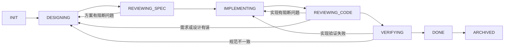

# OfferFlow OpenSpec 工作流

## 目的与入口

把每个阶段的需求、行为、设计、任务、审查和验证放入仓库，方便继续开发和回查决定。使用项目本地 `offerflow-spec-driven` schema，沿用 OpenSpec 的 proposal / specs / design / tasks 制品格式。

[AGENTS.md](../AGENTS.md) 是仓库入口，[项目技能](../.agents/skills/offerflow-workflow/SKILL.md) 是可复用执行入口。详细业务上下文以 [project-context.md](project-context.md) 为准。

## 角色

| 角色 | 定义 | 责任 |
|---|---|---|
| Coordinator | [coordinator.md](../.agents/roles/coordinator.md) | 选择 change、管理状态、授权和交付 |
| Designer | [designer.md](../.agents/roles/designer.md) | proposal、specs、design、tasks |
| Spec Reviewer | [spec-reviewer.md](../.agents/roles/spec-reviewer.md) | 审查需求可验证性和制品一致性 |
| Implementer | [implementer.md](../.agents/roles/implementer.md) | 受控实现与验证、更新任务 |
| Code Reviewer | [code-reviewer.md](../.agents/roles/code-reviewer.md) | 审查实际 diff、行为和测试 |
| Verifier / Archiver | [verifier-archiver.md](../.agents/roles/verifier-archiver.md) | 验证覆盖、同步规范、归档 |

角色是文档契约，由主助手顺序承担即可。只有用户明确请求多 agent 时才实例化子 agent；不依赖 Claude 专用命令、TeamCreate、固定模型或外部通知服务。单助手自审时必须注明 SELF_REVIEW，不能声称独立审查。

## 变更文件

每个正常 change 使用 `openspec/changes/<change-name>/`，名称为 kebab-case。

| 文件 | 内容 |
|---|---|
| `.openspec.yaml` | schema、创建日期；不放本地绝对路径或内部任务系统编号 |
| `proposal.md` | 为什么做、范围、验收条件、能力变更、影响 |
| `specs/<capability>/spec.md` | ADDED / MODIFIED / REMOVED / RENAMED 行为及场景 |
| `design.md` | 现状、决定、接口、数据、事务、依赖、验证与回滚 |
| `tasks.md` | 可验证的任务；完成后才能勾选 |
| `processing/status.md` | 当前状态、授权范围、确认记录、待解决问题、转换日志 |
| `processing/spec-review.md` | 方案审查证据与修订轮次 |
| `processing/code-review.md` | 实际实现或文档变更审查 |
| `processing/verification.md` | 实际验证命令、结果、未运行项和验收对应关系 |

`openspec/specs/` 保存已经验证并同步的稳定规范；规划中的业务能力只放活动 change 或项目上下文，不提前写成已实现规范。`processing` 文件是仓库约定，不是 OpenSpec CLI 自带的强制门控。

## 正常流程

1. **预检与 INIT**：核对实际工作区、相关规则、当前分支与 diff、已有 change、工具及授权。缺少 Java 不阻断纯文档；缺少 MySQL 阻断需要数据库的验证，而不阻断方案分析。明确区分缺失项与本次必要项。
2. **DESIGNING**：先 proposal，再 specs 和 design，最后 tasks。代码现状以实际文件为证据。小修复可把设计压缩到几条关键决定，不为文档数量扩充范围。
3. **REVIEWING_SPEC**：检查验收、语义、字段、接口、并发、事务、关联关系、任务与场景对应。处理阻断问题；核对所需用户确认是否已有。
4. **IMPLEMENTING**：在已有授权内逐项实现，完成一个紧密关联的单元后验证并更新 tasks。业务规则按需要使用测试先行；文档、配置和低影响改动使用适当检查，不强制机械 TDD。
5. **REVIEWING_CODE**：审查实际 diff 和验证证据。问题按 CODE / SPEC / NEEDS_INPUT 路由；修复后只重新执行受影响的审查和检查。
6. **VERIFYING**：确认每个验收条件有证据、任务完成、迁移和文档一致。未运行的必要检查不能当作通过。
7. **DONE**：实现及验收完成，尚未归档；只在实际完成时记录。若归档在本次交付范围内，继续同步规范并归档。
8. **ARCHIVED**：同步稳定规范，移动到 `openspec/changes/archive/YYYY-MM-DD-<change-name>/`，日期按 Asia/Shanghai。Git 提交与推送是归档后的交付动作，不是业务完成证据；推送失败不改写已完成的验证结果。

每次转换前重读 status.md 和本轮证据。阻断或等待输入时保留当前阶段，在 `阻断项` 中记录原因和续跑条件；输入到达后从实际阶段继续，不伪造完成。

任务清单覆盖实现、审查和验收准备；验收后的规范同步、归档、提交和推送由交付角色完成，不列为归档前必须勾选的任务，避免循环前置条件。

## 确认和审查规则

- 实施范围以当前用户确认或明确授权为准；工程基础可以按明确实施请求完成，不能据此批准其他业务模型或状态建议。新出现且影响语义或数据模型的决定需要明确输入。
- 用户已经批准某模块或本次实现后，不重复要求“方案通过后再确认”“代码通过后再确认”。继续完成范围内测试、修复、审查、归档和已授权推送。
- 工作流文档初始化不能单独作为业务设计确认；后续实施授权以当前用户请求为准。
- FAIL 是有证据的阻断问题；WARN 是可记录的非阻断建议；PASS 有对应证据。NEEDS_INPUT 表示缺少关键业务信息，而非随意猜测责任方。
- 每条问题包含编号、级别、CODE / SPEC / NEEDS_INPUT 归属、文件和行号、影响、修复建议、处理结果。
- WARN 可以在说明影响和接受理由后保留，不追求没有意义的“零建议”。阻断 FAIL 必须解决。
- 同一实质问题重复出现，或同一审查循环修复三轮仍未收敛时，保留证据并请求必要裁定；不把每个小修复都计为独立轮次。

## 验证与模板

本地 schema 的 [模板目录](../openspec/schemas/offerflow-spec-driven/templates/) 定义四类制品。Requirement 使用 SHALL / MUST，Scenario 使用四级标题和 WHEN / THEN；修改既有需求时带上完整场景。

纯文档阶段检查 YAML 解析、schema 依赖、模板引用、Markdown 本地链接、技能 frontmatter 和工作流的实际可用性。CLI 可用时还执行 `openspec schema validate offerflow-spec-driven` 和 `openspec validate <change-name> --strict`。

业务阶段执行受影响单元测试、必要 MySQL 集成测试，以及工程已有的编译打包检查。将命令、退出码和关键结果写入 verification.md；数据库配置指向测试库，不能对个人业务库运行破坏性测试。

没有 CLI 时可以手动维护制品；YAML 或链接检查不等价于 CLI 验证，必须说明验证方式。此时人工逐条同步 delta：保留无关需求、完整替换 MODIFIED、明确执行 REMOVED / RENAMED。没有能力级变更时不虚构业务 spec；采用该版本 CLI 支持的文档变更方式或记录手动模式。

CLI 的 artifact 状态只说明文件与依赖是否满足，不说明人类确认、审查或测试已经通过。安装或升级工具不作为纯文档初始化的前置授权。

## 阶段提交与推送

一个 change 完成实现、审查、验收和归档后，统一提交并普通推送 GitHub 一次；同一 change 的中间方案、代码与修复留在本地，不分阶段反复推送。

默认将单用户项目已验证的阶段以普通提交推送到 `origin/main`。已有迭代分支时尊重其工作流；不擅自切换有未提交改动的分支，不重写远程历史。

提交前检查真实 diff、待提交清单、忽略规则和远程地址。只提交本 change 的文件，提交信息体现阶段；不能把参考压缩包、企业内部资料、个人数据或凭据加入公开仓库。

推送前核对远程进展；远程有新提交时先安全整合并重新检查，不强推。认证或网络失败时保存本地提交，说明具体状态和下一步，不声称推送成功。

不把“包含本文件的提交 SHA”反复写回文件，避免为了记录自身 SHA 产生递归提交；交付消息报告实际 SHA 和远程结果。

## 状态文件最小格式

status.md 包含：change 名称、当前阶段、范围授权来源、设计确认情况、审查方式、阻断项、最近证据，以及带日期的状态转换表。审查报告记录轮次，verification.md 记录 PASS / FAIL / NOT_RUN。

不在状态或缓存里保存账号令牌、机器标识、用户名目录或原始附件绝对路径。

## 参考适配

保留参考项目的制品拆分、职责分离、状态恢复、问题路由与验证归档。去除企业任务编号、飞书通知、推荐系统规则、固定模型及“所有警告必须清零”的要求；按 OfferFlow 已有阶段推送授权调整 Git 行为。

OpenSpec 配置和本地 schema 的格式依据 [官方定制文档](https://github.com/Fission-AI/OpenSpec/blob/main/docs/customization.md)。项目技能目录依据 [OpenAI 官方技能说明](https://learn.chatgpt.com/docs/build-skills)。原始参考文件未复制入公开仓库。
