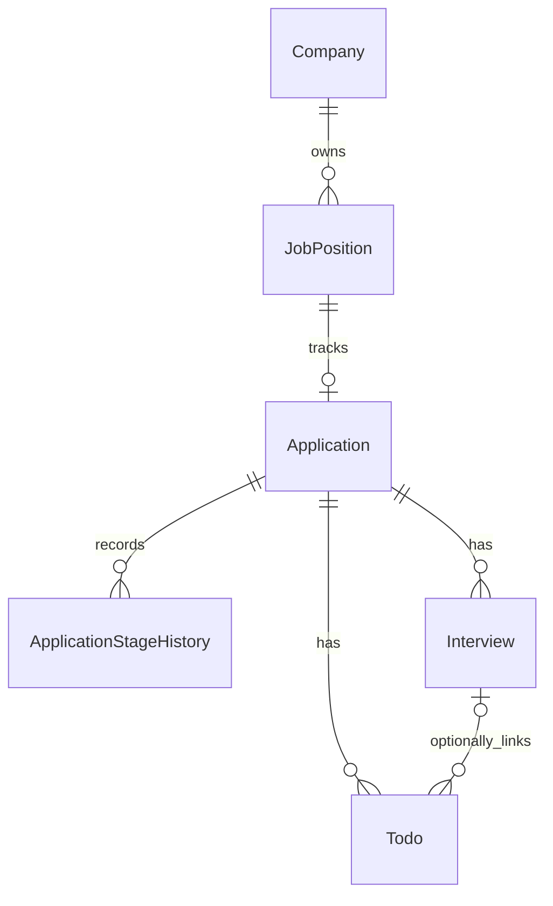

# Design

## Context

本 change 开始时，pom.xml 只有 Web、Validation、Test；application.yml 只有应用与 HTTP 配置。已有 18 项行为测试和无数据库启动约定。本机可用 MySQL 8.0.34 二进制及运行中的服务；验证使用二进制创建独立临时实例，不接触现有服务或业务数据库。

## Goals / Non-Goals

交付下一阶段业务实现可直接使用的迁移和模型。不提前实现业务 API 或自动状态转换。当前个人单用户版本不增加 user_id；以后多用户通过明确迁移扩展。

## Decisions

### 依赖与启动模式

- MyBatis-Plus Spring Boot 3 starter 3.5.17：六个 BaseMapper 和 Application 乐观锁；不额外引入 MyBatis starter、分页解析器或生成器。
- MySQL Connector/J 9.7.0、Flyway core / flyway-mysql 11.7.2、Lombok 1.18.46 使用 Spring Boot 3.5.16 BOM 管理的版本。Flyway MySQL 支持需要独立模块；Lombok 只生成实体访问器，不生成含个人文本的 toString。
- 依赖选择核对 [MyBatis-Plus 官方安装说明](https://baomidou.com/getting-started/install/) 与 [Flyway MySQL 模块说明](https://documentation.red-gate.com/fd/mysql-277579322.html)。UTC 参数核对 [Connector/J 时间处理说明](https://dev.mysql.com/doc/connector-j/en/connector-j-connp-props-datetime-types-processing.html)；实际版本与兼容性仍通过本工程运行验证。
- Maven Failsafe 使用父 POM 管理的版本，在 mysql-integration profile 下执行 *IT；普通 verify 保持无数据库检查。必需数据库验收由显式集成 profile 执行，不用跳过或 H2 代替。
- 默认 standalone profile 排除 DataSource 自动配置；mysql profile 配置真实 DataSource / Flyway / Mapper，数据库不可用、非空未基线数据库或 checksum 异常应使启动失败。Flyway clean 关闭，不自动 baseline。
- Hikari 连接强制 UTC session；日期用 LocalDate，具体时刻用 Instant，数据库为 UTC DATETIME(6)。避免依赖本机 JVM / 数据库时区。MySQL 8.0.16+ 才支持执行 CHECK；本次实际验证版本为 8.0.34。8.4 LTS 为部署建议，不能称已验证。

### 核心关系

Company 1:N JobPosition；JobPosition 1:0..1 Application。同一具体岗位多渠道投递合并为一份档案，channel 保存主要渠道，其他入口可写 notes；不同招聘批次使用不同 JobPosition。用户本轮“都按推荐”明确确认此规则。Application 1:N History / Interview / Todo。Todo 可关联 Interview，但必须属于同一个 Application，通过组合外键实现；这种关联不等于已经实现自动同步。

所有外键 RESTRICT 删除 / 更新。迁移不提供 DELETE API，避免清理公司或岗位时连带抹去求职历史。公司名及岗位名不设置唯一约束，同名法人或不同招聘批次允许分开记录。

ER 关系如下：

### 字段及用途

所有表有自增 BIGINT id、created_at、updated_at（DATETIME(6)，数据库管理记录创建和修改时间），不替代业务发生日期。Entity 的审计字段不参加 Mapper INSERT / UPDATE，防止读取后的旧时间覆盖数据库值。History 的修改时刻仅为数据库记录元数据，不授权历史编辑 API。

| 表 | 字段 | 原因与约束 |
|---|---|---|
| company | name VARCHAR(255)、type VARCHAR(32)、website VARCHAR(2048)、notes TEXT | 用户原始需求；类型覆盖互联网、银行、央国企、研究所、外企及其他；官网和备注可空 |
| job_position | company_id、name VARCHAR(255)、location VARCHAR(255)、direction VARCHAR(128)、jd MEDIUMTEXT、recruitment_batch VARCHAR(64) | 岗位归公司；方向使用可扩展文本；批次区分不同年份 / 批次的 JD，非必填，无公司 / 岗位名联合唯一键 |
| application | job_position_id、channel VARCHAR(64)、applied_on DATE | 渠道与实际投递日期属于投递档案；渠道记录主要入口，未知投递日期可空 |
| application | submitted BOOLEAN、current_stage VARCHAR(24)、current_stage_on DATE | submitted 记录实际投递事实，避免用未知日期或当前状态猜测是否投递；当前阶段日期与录入时间分离，日期未知可空 |
| application | end_reason VARCHAR(32)、notes TEXT、version INT | REJECTED 仅指企业拒绝；ENDED 必须记录接受 / 主动拒绝 Offer、撤回、岗位关闭或其他原因（用户本轮确认）；备注承载人工说明；version=0 起供乐观锁使用，防止随后事务静默覆盖 |
| application_stage_history | application_id、stage VARCHAR(24)、stage_on DATE、end_reason VARCHAR(32)、remark TEXT | 每个历史条目独立保存阶段、业务日期与原因；补录日期未知仍可存储，created_at 代表录入时刻 |
| interview | application_id、round_name VARCHAR(64)、interview_at DATETIME(6)、format VARCHAR(16)、questions / answers / review MEDIUMTEXT、result TEXT | 轮次与结果使用人工文本，不假定一次面试必然对应当前阶段；时间及形式未知允许 NULL，不伪造发生时间 |
| todo | application_id、interview_id 可空、kind VARCHAR(24)、title VARCHAR(255)、due_at DATETIME(6)、completed BOOLEAN、completed_at DATETIME(6)、notes TEXT | 对应五类待办并支持其他；标题解释实际事项；未知截止时间可空（未来近期列表只取已知时间）；完成标志避免把过去时间误当已完成；完成时间未知可空 |

待投递、已投递、测评、笔试、一 / 二 / 三面、HR 面、Offer、已拒绝、已结束分别为 TO_APPLY、SUBMITTED、ASSESSMENT、WRITTEN_TEST、FIRST_INTERVIEW、SECOND_INTERVIEW、THIRD_INTERVIEW、HR_INTERVIEW、OFFER、REJECTED、ENDED。结束原因为 ACCEPTED_OFFER、DECLINED_OFFER、WITHDRAWN、POSITION_CLOSED、OTHER。VARCHAR 使用 ASCII 二进制排序规则，CHECK 再用 CAST AS BINARY 作精确比较，拒绝大小写错误或尾随空格，避免 Java 枚举读回失败。

SQL 仅保证取值、关联和静态事实一致性：布尔值只能 0 / 1，非负 version，未实际投递不能有 applied_on，未完成不能有 completed_at。Application 和 History 的 ENDED 必须有有效 end_reason，其他阶段必须无结束原因；REJECTED 不混入主动拒绝方向。未来 Service 才维护快照 / 历史事务、跳阶段、补录和纠正；Mapper 不对外提供 API，不声称自动维护所有历史。

### 索引

- Company 名称；JobPosition company_id：公司搜索和按公司列岗位。
- Application current_stage / current_stage_on / id、submitted / applied_on / id：阶段筛选、停滞查询及最近实际投递；job_position_id UNIQUE 保证每个具体岗位最多一档案。
- History application_id / id：单档案完整历史与稳定顺序。
- Interview application_id / interview_at / id、interview_at / id：单档案及最近面试；id / application_id 组合 UNIQUE 专为跨投递关联保护。
- Todo application_id / id、completed / due_at / id、interview_id / application_id：关联查询与未来近期待办。

索引不涉及 JD / 问答全文搜索，不做重复的低选择性单列状态索引。

## Change Scope

pom.xml、application 配置、common/persistence、config 及六个业务包的 entity / mapper；V1 SQL、src/test 的 MySQL IT、隔离实例运行脚本、README 和数据库说明。无空 Controller / Service / DTO / VO 样板。

## Data / API / Transactions

没有新增 HTTP 接口。保留原有 JSON、异常和 health 合同；health 只表示进程存活。数据库连接账户和库由使用者准备，迁移只建业务表，不自动创建账户或使用 root 默认密码。

每个 Application 的 version 是并发控制基础。集成测试通过 TransactionTemplate 同时改快照、插历史后抛异常，验证真实回滚并保留原历史；这验证事务基础，不是已经实现阶段服务。

Application.currentStageOn / endReason 的 updateStrategy 为 ALWAYS：读取完整快照后切换阶段，必须能将原阶段日期或结束原因明确清空，避免默认忽略 NULL 留下旧值或违反 CHECK。后续 Service 使用完整已读取实体及 version 更新，不将不完整请求 DTO 直接交给 Mapper；普通业务字段的 PATCH / 清空语义由对应 API change 定义。

日期可空不代表录入时间已知的阶段业务日期已知。未来接口需显式校验日期 / 时刻、转换带时区输入为 Instant，并保留 NULL。

## Verification

1. schema / change strict 校验；核对所有新字段、依赖和约束与需求。
2. wrapper verify：原 HTTP 行为与可执行 Jar 打包。
3. mysql-integration verify：独立测试实例，Flyway migrate / 再运行 / checksum 失败、六实体中文及枚举读写、外键 / CHECK / 唯一性、UTC 和微秒、乐观锁、事务回滚。
4. 可执行 Jar 使用 mysql profile 启动并探测 health；standalone 仍可启动；无效端口连接必须启动失败。
5. 文档链接、XML / YAML、git diff / 忽略规则 / 公共凭据检查；SELF_REVIEW。
测试脚本只使用自己创建的临时 datadir 和进程，连接 127.0.0.1 的独立端口，随机测试凭据仅存在内存。IT 要求显式 OFFERFLOW_TEST_* 配置并验证库名前缀；未提供应失败，不静默跳过。

HTTP 测试明确使用 standalone，避免环境中已有数据库配置激活迁移。MySQL IT 在访问业务表前验证显式测试 URL、专用库名前缀及空 schema；两个专用库分别用于应用模型和 Flyway 的校验失败测试，已存在任何表时拒绝测试。脚本每次建立新的随机库；不通过删除已有表来准备环境。

## Risks / Rollback

MySQL DDL 非事务化；首次迁移失败不能靠应用事务撤销，Flyway 应阻止继续，管理员排查并修复专用库。V1 一旦使用后不修改，后续追加 V2。撤回代码不等于删除已存数据；默认不提供自动 down / clean。本阶段只在空的独立测试库验证，不操作个人现有数据。

## Open Questions

无。本轮用户“都按推荐”确认同岗位合并档案和拒绝方向；对应唯一键、结束原因与约束已明确。其他未来业务接口语义在相应 change 定义，本次不提前批准。
